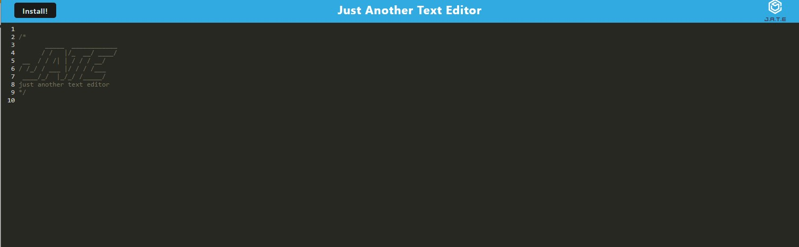

## JATE: Text Editor

```
Deployed Application: [JATE](https://pacific-thicket-62202.herokuapp.com/)
```

## Table-of-Contents

1. [Description](#description)

2. [User Story](#user-story)

3. [Installation](#installation)

4. [Usage](#usage)

5. [Technologies](#technologies)

6. [Contact Me](#contact-me)


## Description

A text editor appliaction that runs in the browser and meets PWA criteria. JATE can function both online and offline and can be useful for saving code snippets when there is not internet connection.  


## User Story 

```md
AS A developer
I WANT to create notes or code snippets with or without an internet connection
SO THAT I can reliably retrieve them for later use
```

## Installation

JATE can be run in your borwser by using the link to the deployed application above. For offline use you may click the "install" button in the upper left corner on the screen. You can also install the app to your local computer following the steps below:

* Clone the repository using this link: https://github.com/Laurencvengros/19_Text-Editor


 * To install the necessary dependencies open the terminal in the root folder of the application and enter the command 

 ```npm install```

* To start the application, enter the command 

```npm run start``

* navigate to localhost:3001 in your browser to begin using JATE


## Usage

* The screenshot below shows what the application looks like in the browser. Navigate to the deployed application link to begin using JATE.

 


## Technologies

* JAte uses the folloing technologies:

1. Node.js
2. PWA/Webpack
3. Express.js

## Contact Me

This Application was created by me, Lauren Cvengros.

For questions/comments/concerns please contact me via the information below

* Author: Lauren Cvengros
* Email: L.Cvengros@icloud.com
* github: Lauurencvengros -> https://github.com/Laurencvengros